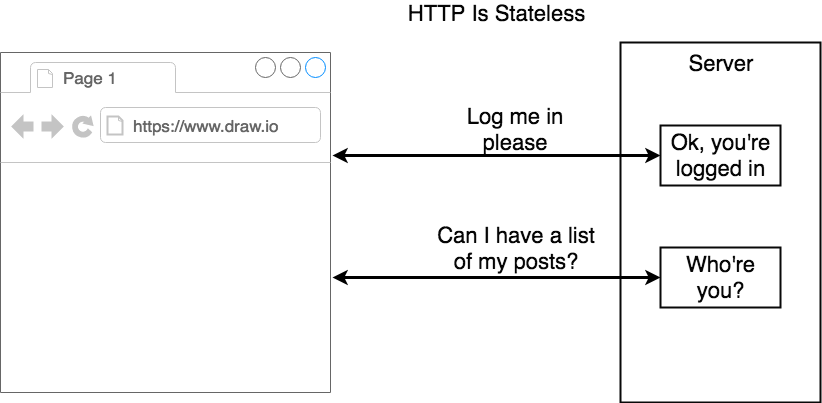
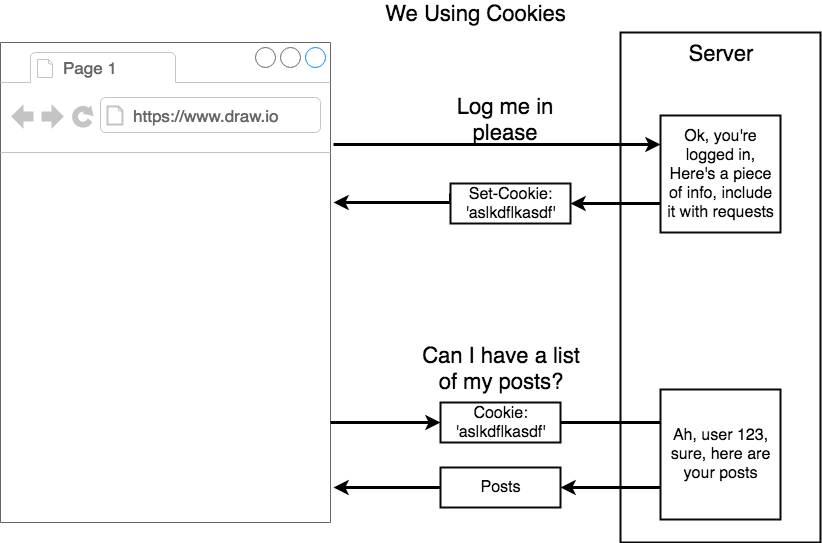
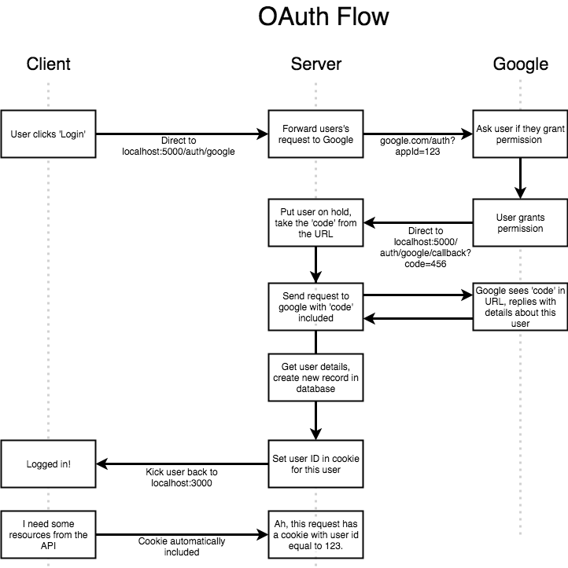
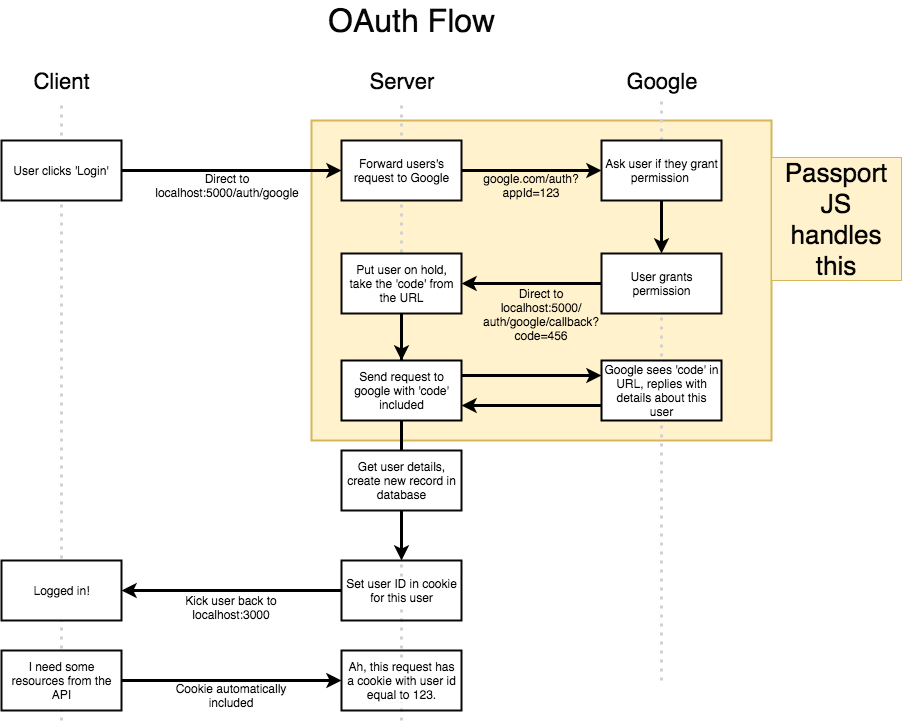
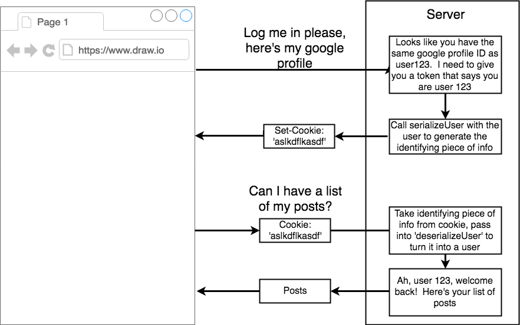
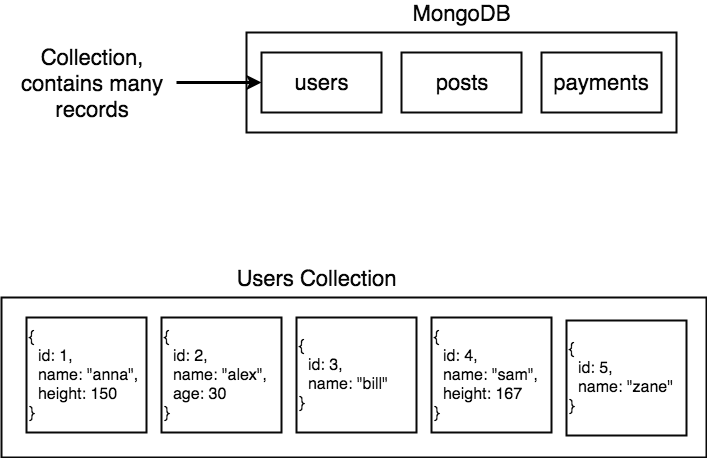
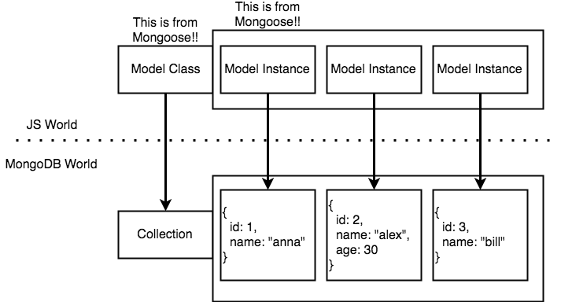

# Node with React fullstack web development

Notes for Stephen Grider's course on [Udemy](https://www.udemy.com/node-with-react-fullstack-web-development)

## Table of Contents

* [Stack](#stack)
* [App Flow](#app-flow)
* [Deployment Checklist](#deployment-checklist)
* [Google OAuth](#oauth)
* [Mongo Db](#mongodb)
* [Dev vs Prod environments](#dev-prod-keys)

## Stack

1.  Oauth
    1.  Express
    2.  MongoDB
    3.  Passport
2.  Payment
    1.  Stripe
    2.  MongoDB
3.  New campaign
    1.  React
    2.  Redux
4.  User types emails for campaign
    1.  React
    2.  Redux
    3.  Redux Form
5.  Send email to users
    1.  Email Provider
6.  Click on email button to give feedback
    1.  Email Provider
    2.  Express
    3.  MongoDB
7.  Tabulate feedback
    1.  Mongo
8.  User can see report of feedback
    1.  Mongo
    2.  React
    3.  Redux

## App Flow

1.  Login
2.  See current campaigns
3.  Add credits
4.  Add Campaign

## Deployment Checklist

1.  Dynamic Port Binding
    Cloud provider indicates the port the app must run on
    process.env.PORT

2.  Specify Node Environment
    Need to tell cloud provider which node version we want

```json
// package.json
{
  "engines": {
    "node": "8.1.1",
    "npm": "5.0.3"
  }
}
```

3.  Specify start script
    Instruct cloud provider command to run app

```json
// package.json
{
  "scripts": {
    "start": "node index.js"
  }
}
```

4.  Create `.gitignore`
5.  Install Heroku CLI (https://devcenter.heroku.com/articles/heroku-cli)
6.  Push to remote heroku branch (https://devcenter.heroku.com/articles/git)

## OAuth

### Key concepts about authentication

* HTTP is stateless



* Cookie-based authentication



* Signing in users flow with OAuth
  1.  Attempt to authorize for the 1st time
  2.  Google Servers: Give consent
  3.  Back in the app: Look in the database for user.id. Exists ? yes, you're user x. Does not exist ? Let's create a record for the user


### Basic OAuth Flow



### Oauth Flow with PassportJS

1.  Passport
    General helpers
2.  Strategies
    Specific helpers(google, facebook, local etc)



### Authorized Redirect UI's

1.  Client: Go to `/auth/route`
2.  Server: There's a `auth/route` handler!
3.  Server: Pass to Google with secret, id and callback url
4.  Google Server: This callback url I just received, is it verified ? (Set up in Google dev console)

### Callback Information from Google OAuth

Callback receives several parameters:

1.  Access Token: with this we are able to access JUST what the user agreed to
2.  Refresh token: Access token expires after some amount of time. So with this we can get a new one if needed
3.  Profile: Actual user's data

### Serializing and Deserializing users



## MongoDB

### Mongo Collections



### MongoDB vs JSWorld



## Dev Prod Keys

* Dev keys for development environment. Production keys for Cloud provider.
* With this approach we can have 2 separate mongo databases.


